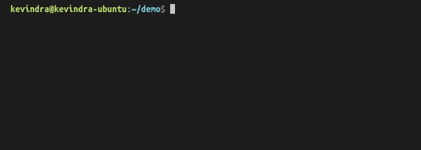

# `ChitchatJS`


ChitchatJS (`cjs`) is used to create, manage, and deploy machine learning based voice interfaces easily to Alexa.

> WORK IN PROGRESS, STAY TUNED.

## Getting Started

### Install CLI

```
$ npm install -g @chitchatjs/cli
```

### Create new project

```
$ cjs new
```



### Compile

```
$ cjs compile
```

### Deploy

```
$ cjs deploy
```

### Test

```
$ cjs test
```

----
## Writing Bot

### Dialog Script

#### A basic hello world dialog script.

```typescript
let sampleInteraction: cjs.Interaction = {
    user: {
        trigger: <cjs.UtteranceTrigger>{
            texts: ["Hello, how are you"]
        }
    },
    system: {
        actions: [
            <cjs.TellSpeechAction>{
                text: "I'm good, thank you!"
            }
        ]
    }
}

export let dialog: cjs.Dialog = { interactions: [sampleInteraction] }
```

----
## Future Ideas
Even more abstractions!

```typescript
when()
    .userSays(["Hello, how are you"])
.then()
    .actions()
        .say("I'm good, thank you")
.build()
```

```typescript
when()
    .launch()
.then()
    .actions()
        .ask()
            .question("Welcome, ask me something!")
            .reprompt("you can ask how am I")
.build()
```