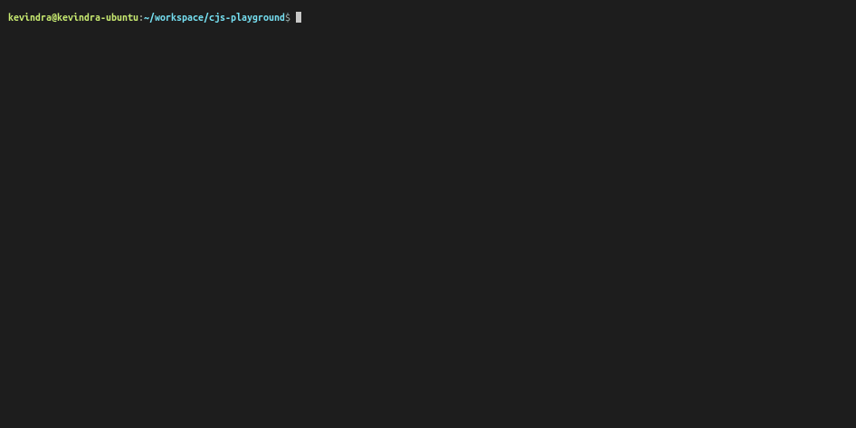

# `ChitchatJS`


ChitchatJS framework is used to create, manage, and deploy machine learning or rule based voice interfaces easily.

[![Code Coverage][coverage-badge]][coverage-link]
[![Code Coverage][core-badge]][core-link]
[![Code Coverage][cli-badge]][cli-link]
[![Code Coverage][alexa-badge]][alexa-link]

> WORK IN PROGRESS, STAY TUNED.

## Getting Started

### Install CLI

```
$ npm install -g @chitchatjs/cli
```

### Create new project

```
$ cjs new
```



### Compile

```
$ cjs compile
```

### Deploy

```
$ cjs deploy
```

### Test

```
$ cjs test
```

---

## Writing Bot

### Dialog Script

#### A basic hello world dialog script.

```typescript
let sampleInteraction: cjs.Interaction = {
    user: {
        trigger: <cjs.UtteranceTrigger>{
            texts: ["Hello, how are you"],
        },
    },
    system: {
        actions: [
            <cjs.TellSpeechAction>{
                text: "I'm good, thank you!",
            },
        ],
    },
};

export let dialog: cjs.Dialog = { interactions: [sampleInteraction] };
```

---

## Future Ideas

Even more abstractions!

```typescript
when()
    .userSays(["Hello, how are you"])
    .then()
    .actions()
    .say("I'm good, thank you")
    .build();
```

```typescript
when()
    .launch()
    .then()
    .actions()
    .ask()
    .question("Welcome, ask me something!")
    .reprompt("you can ask how am I")
    .build();
```

[coverage-badge]: https://codecov.io/gh/chitchatjs/chitchatjs/branch/main/graph/badge.svg
[coverage-link]: https://codecov.io/gh/chitchatjs/chitchatjs
[core-badge]: https://codecov.io/gh/chitchatjs/chitchatjs/branch/main/graph/badge.svg?flag=core
[core-link]: https://codecov.io/gh/chitchatjs/chitchatjs
[cli-badge]: https://codecov.io/gh/chitchatjs/chitchatjs/branch/main/graph/badge.svg?flag=core
[cli-link]: https://codecov.io/gh/chitchatjs/chitchatjs
[alexa-badge]: https://codecov.io/gh/chitchatjs/chitchatjs/branch/main/graph/badge.svg?flag=core
[alexa-link]: https://codecov.io/gh/chitchatjs/chitchatjs
[core-package]: ./packages/core
[cli-package]: ./packages/cli
[alexa-package]: ./packages/alexa
[core-npm-badge]: https://img.shields.io/npm/v/@chitchatjs/core.svg
[cli-npm-badge]: https://img.shields.io/npm/v/@chitchatjs/cli.svg
[alexa-npm-badge]: https://img.shields.io/npm/v/@chitchatjs/alexa.svg
[core-npm-link]: https://www.npmjs.com/package/@chitchatjs/core
[cli-npm-link]: https://www.npmjs.com/package/@chitchatjs/cli
[alexa-npm-link]: https://www.npmjs.com/package/@chitchatjs/alexa
[core-issues-badge]: https://img.shields.io/github/issues/chitchatjs/chitchatjs/package:%20core?label=issues
[cli-issues-badge]: https://img.shields.io/github/issues/chitchatjs/chitchatjs/package:%20cli?label=issues
[alexa-issues-badge]: https://img.shields.io/github/issues/chitchatjs/chitchatjs/package:%20alexa?label=issues
[core-issues-link]: https://github.com/chitchatjs/chitchatjs/issues?q=is%3Aopen+is%3Aissue+label%3A"package%3A+core"
[cli-issues-link]: https://github.com/chitchatjs/chitchatjs/issues?q=is%3Aopen+is%3Aissue+label%3A"package%3A+cli"
[alexa-issues-link]: https://github.com/chitchatjs/chitchatjs/issues?q=is%3Aopen+is%3Aissue+label%3A"package%3A+alexa"
