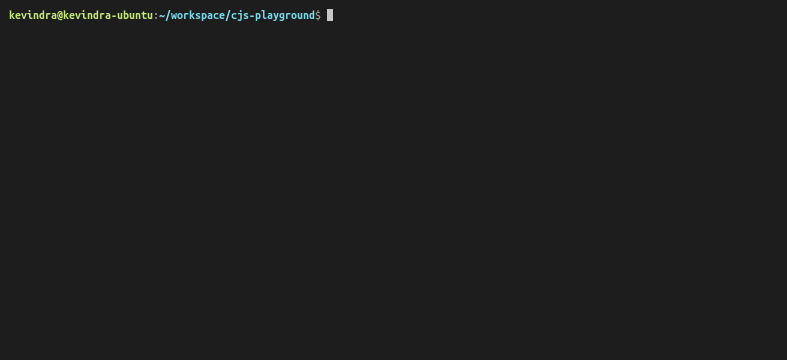

# `@chitchatjs/alexa`


<strong>🤖 JavaScript framework for building voice user interfaces for Alexa Skills. </strong> | <a href="https://chitchat.js.org">📄 Read the documentation </a>

| Package                                                              | NPM                                                                                                                  | Build                                                                                                                                            |
| -------------------------------------------------------------------- | -------------------------------------------------------------------------------------------------------------------- | ------------------------------------------------------------------------------------------------------------------------------------------------ |
| [@chitchatjs/cli](https://www.npmjs.com/package/@chitchatjs/cli)     | [](https://badge.fury.io/js/%40chitchatjs%2Fcli)     | [](https://github.com/chitchatjs/chitchatjs/actions) |
| [@chitchatjs/alexa](https://www.npmjs.com/package/@chitchatjs/alexa) | [](https://badge.fury.io/js/%40chitchatjs%2Falexa) | [](https://github.com/chitchatjs/chitchatjs/actions) |
| [@chitchatjs/core](https://www.npmjs.com/package/@chitchatjs/core)   | [](https://badge.fury.io/js/%40chitchatjs%2Fcore)   | [](https://github.com/chitchatjs/chitchatjs/actions) |

<br/>

**Get in touch**

[](https://gitter.im/chitchat-js/community)

## Demo



## What is chitchat.js?

Chitchat.js (or CJS) is a framework for building voice driven multi-modal user interfaces (a.k.a. VUI). Chitchat is designed to be incrementally adaptable. Chitchat comes with three primary components - core library (`@chichatjs/core`), a CLI (`@chitchatjs/cli`) and the implementation strategies (dialog management) which may or may not be platform dependent. It offers `@chitchatjs/alexa` to seamlessly integrate your voice user interface with Alexa.

`@chichatjs/core` is a primitive base that defines core framework premitives that are voice-platform and dialog management strategy agnostic. `@chitchatjs/cli` provides an easy command access to create a project, build and deploy it (only supported for Alexa platform right now). `@chitchatjs/alexa` is a collection of VUI components designed on top of the core library specifically for Alexa Skill development.

## Why use chitchat.js?

### Simplicity

Write your entire Alexa skill using Typescript or Javascript in a declarative style. Build on what you know already.

### Pluggable Design

Do more with fewer lines of code. Framework helps you design your experience using Building Blocks.

### State Management

Chitchat.js designs the entire skill into states and building blocks. Every state is linked to one building block, which handles a piece of conversation. For example - MovieRecommendation might be a state where we handle user's requests related to movie recommendations. Chitchat also makes it super easy to transition between states using builtin state transition building blocks.

### Community

Find and share reusable Building Blocks and enrich the experience even further.

## Prerequisites

Chitchat requires the following dependencies:

- Node.js
- [ASK CLI (configured)](https://www.npmjs.com/package/ask-cli)

## Quick Start

**1. Installation**

```sh
npm i -g @chitchatjs/cli
```

**2. Creating a new project**

```sh
# then choose a starting template
cjs new
```

**3. Build the project**

```sh
# tsc only if it is a typescript project
tsc && cjs build
```

**4. Deploy**

```sh
cjs deploy
```

**5. And test..**

You can either go to [Alexa Developer Console](https://developer.amazon.com) and open your skill and then go to the test tab.
Or you can use [ask dialog command](https://developer.amazon.com/en-US/docs/alexa/smapi/ask-cli-command-reference.html#dialog-command) to test your dialog in CLI itself.

```sh
ask dialog --skill-id <skill-id> --locale en-US --stage development

U> open my skill
A> hello world!
```

## Writing a basic skill

To get started, simply write this in your index.ts

```ts
import { alexa as ax } from "@chitchatjs/alexa";

let state = ax.start().block(ax.say("Hello world")).build();

// create our skill using the state above
let skill = ax.skill().addState(state).build();

exports = ax.dialogManager(skill).exports();
```

Above would render "Hello world" speech for every request user makes. Let's add a dialog turn to ask user their name:

```ts
import { alexa as ax } from "@chitchatjs/alexa";

let state = ax
  .start()
  .block(
    ax
      .compound()
      // welcome message
      .add(ax.ask("Hello, what is your name?").build())
      .add(
        // simple!
        ax
          .whenUserSays(["my name is {name}", "{name}", "name is {name}"])
          .withSlotType("name", "AMAZON.FirstName")
          // {name} allows automatic slot resolution
          .then(ax.say("Welcome, {name}! It's nice to talk to you."))
          .build()
      )
      .build()
  )
  .build();

...
```

## Writing a reusable Building Block

We can also turn "greeting with the name" a building block to componentize it better.

```ts
import { alexa as ax } from "@chitchatjs/alexa";

export namespace greetings {
  export let greetWithName = () => {
    return ax
      .whenUserSays(["my name is {name}", "{name}", "name is {name}"])
      .withSlotType("name", "AMAZON.FirstName")
      .then(ax.say("Welcome, {name}! It's nice to talk to you."))
      .build();
  };
}
```

Now, we can simply plug it into our skill:

```ts
import { alexa as ax } from "@chitchatjs/alexa";
import { greetings as g } from "./greetings";

let state = ax
  .start()
  .block(
    ax
      .compound()
      // welcome message
      .add(ax.ask("Hello, what is your name?").build())
      // plugin our component here
      .add(g.greetWithName())
      .build()
  )
  .build();

...
```

Then,

```sh
> tsc
> cjs build
> cjs deploy
```

That's it!

## Packages

1. [chitchat.js core library](https://www.npmjs.com/package/@chitchatjs/core)
2. [chitchat.js alexa library](https://www.npmjs.com/package/@chitchatjs/alexa)
3. [chitchat.js cli](https://www.npmjs.com/package/@chitchatjs/cli)

**Sample Skills**

1. [Hello bot](https://github.com/chitchatjs/hello-bot-template)
2. [Dog Matcher](https://github.com/chitchatjs/pet-match-template)
3. [High log game](https://github.com/chitchatjs/high-low-game)
4. [Coffee shop](https://github.com/chitchatjs/coffee-shop)

**Plugins**

1. [@chitchatjs/plugin-ax-common](https://www.npmjs.com/package/@chitchatjs/plugin-ax-common)
2. [@chitchatjs/plugin-ax-session](https://www.npmjs.com/package/@chitchatjs/plugin-ax-session)
3. [@chitchatjs/plugin-ax-display](https://www.npmjs.com/package/@chitchatjs/plugin-ax-display)

Check the official documentation of available Blocks and much more here - https://chitchat.js.org/
