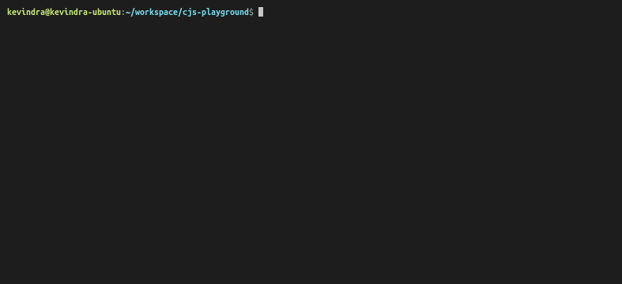

# `ChitchatJS CLI`


## Prerequisites

Chitchat requires the following dependencies:

- Node.js
- [ASK CLI (configured)](https://www.npmjs.com/package/ask-cli)

## Quick Start



1. Install CLI

```sh
npm install -g @chitchat/cli
```

2.  Create a new project

Projects can be created from a prebuilt template. CJS is agnostic of the Node language you use, you can use Typescript or Javascript based templates.

```sh
cjs new
```

3. Build the project

Building a project generates all the required artifacts, and the backend infrastructure.

```sh
cjs build
```

4. Deploy

Deploy command deploys the generated project to the chosen platform.

```sh
cjs deploy
```

::: tip Info
Examples below are shown using the Alexa implementation `@chitchatjs/alexa` of the framework.
:::

## Examples

### Hello World

```ts
import { alexa as ax } from "@chitchatjs/alexa";

// A sample conversation
let initialState = ax.start().block(ax.say("Hello world!")).build();

// Skill Definition that wires all the
// states and transitions together
let skillDefinition = ax.definition().addState(initialState).build();

export = ax.dialogManager(skillDefinition).exports();
```

Output:

```
User: open my skill
Alexa: Hello world!
```

### Food Menu

```ts
import { alexa as ax } from "@chitchatjs/alexa";

let initialState = ax
  .start()
  .block(ax.ask("Welcome, do you want menu for breakfast, lunch or dinner?").build())
  .block(ax.goto("food-menu"))
  .build();

let foodMenuState = ax
  .state("food-menu")
  .block(
    ax
      .compound()
      .add(
        ax
          .whenUserSays(["breakfast", "i want breakfast"])
          .then(ax.say("okay I have egg omlette for breakfast today."))
          .build()
      )
      .add(ax.whenUserSays(["lunch", "i want lunch"]).then(ax.say("okay I have biryani for lunch today.")).build())
      .add(
        ax
          .whenUserSays(["dinner", "i want dinner"])
          .then(ax.say("okay I have chicken curry, roti for dinner today."))
          .build()
      )
      .build()
  )
  .build();
export = ax.dialogManager(definition).exports();
```

Output:

```
U: open my skill
A: Welcome, do you want menu for breakfast, lunch or dinner?
U: lunch
A: okay I have biryani for lunch today
```

To learn more, check the guide on https://chitchat.js.org
